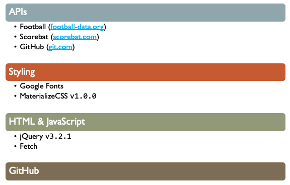
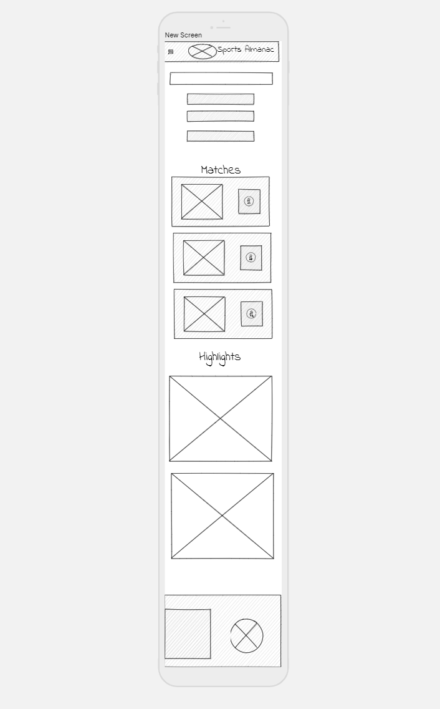
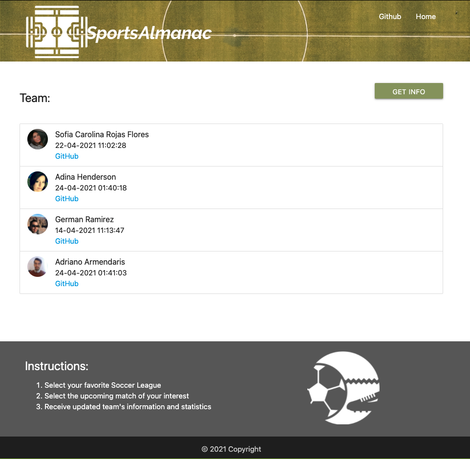

## Sports Almanac

As a sports fan, the user will see a list of soccer matches where:

- On searching for a league, the app will display the match on the closest dates, display both teams, scheduled date for the match.

- This valuable information will provide the user with statistics and an option to view highlights in of match restuls or scores in videos directly from the official team sites.

- In addition, the app includes historical data, where if the user already performed a search for a particular league, that search will be available in for reload on the History section.

## Features

- Drop-down menu to select the league
- Search History displayed for revisit
- Displayed data will present:
  - Leagues
  - Matches of selected league
  - Team information
- Videos to game highlights and goals
- Pop-up module for selected match with the match information and scores.

---

## Resources utilized

APIs:

Three APIS were utilized for this project:

---

## Wireframe

Desktop Screen:
----

Mobile Screen:
----

---

## Mock image

Main page:

Credits page:

## Link to the web page

[Link to the web page](https://adina-hc.github.io/sports-almanac/)
